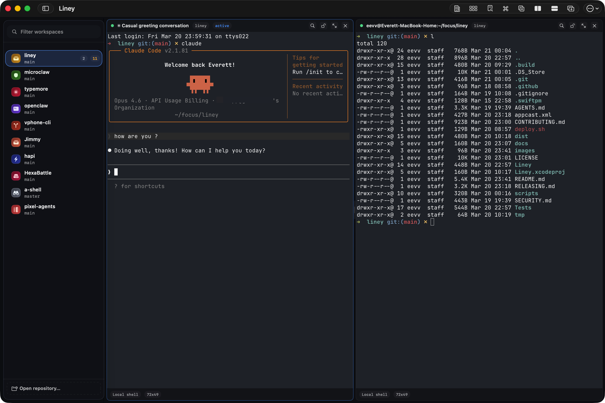

# AiyuTerm

[中文版本](./README.zh-CN.md)

AiyuTerm is a native macOS terminal workspace app for developers who work across repositories, worktrees, branches, and split panes. It supports local shell, SSH, tmux sessions, and AI agent-backed terminal sessions with real-time status badges.

> AiyuTerm is forked from [Liney](https://github.com/wuwenrui/liney) by wuwenrui. Thanks to the original author for the excellent foundation.

## Features

- Keep multiple repositories and worktrees in one sidebar
- Reopen the same pane layout when you come back to a repo
- Mix local shell, SSH, and agent-backed terminal sessions
- Tmux session management with sidebar panel (attach, create, rename, kill)
- Agent status badges: real-time permission and task completion notifications for Claude Code
- Stay in a native macOS app built around keyboard-heavy workflows

## Install

### Direct Download

Download the latest signed `.dmg` from GitHub Releases:

<https://github.com/AiyuAI/AiyuTerm/releases/latest>

## Quick Start

1. Open AiyuTerm
2. Add one or more local repositories to the sidebar
3. Select a repository or worktree and open a terminal tab
4. Split panes as needed and switch worktrees without rebuilding your layout

## Agent Status Badges

AiyuTerm shows real-time status on sidebar icons when Claude Code needs attention:

| Status | Badge | Trigger |
|--------|-------|---------|
| Permission needed | Red pulse | Claude Code waiting for user approval |
| Task completed | Green checkmark | Claude Code finished a task |
| Error | Red static | Claude Code encountered an error |

Powered by Claude Code hooks. See [docs/agent-status-badges.md](./docs/agent-status-badges.md) for setup.

## Requirements

- macOS 14.6 or later
- Universal build: Apple Silicon and Intel Macs

## For Developers

Development setup, build commands, testing, and release docs: [`DEVELOP.md`](./DEVELOP.md).

## Acknowledgments

- [Liney](https://github.com/wuwenrui/liney) by wuwenrui -- the original open-source terminal workspace app this project is forked from
- [Ghostty](https://ghostty.org/) -- the terminal engine powering AiyuTerm
- [Sparkle](https://sparkle-project.org/) -- auto-update framework

## License

Released under the Apache License 2.0. See [`LICENSE`](./LICENSE).
