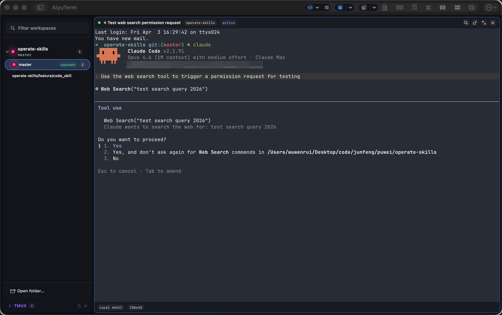
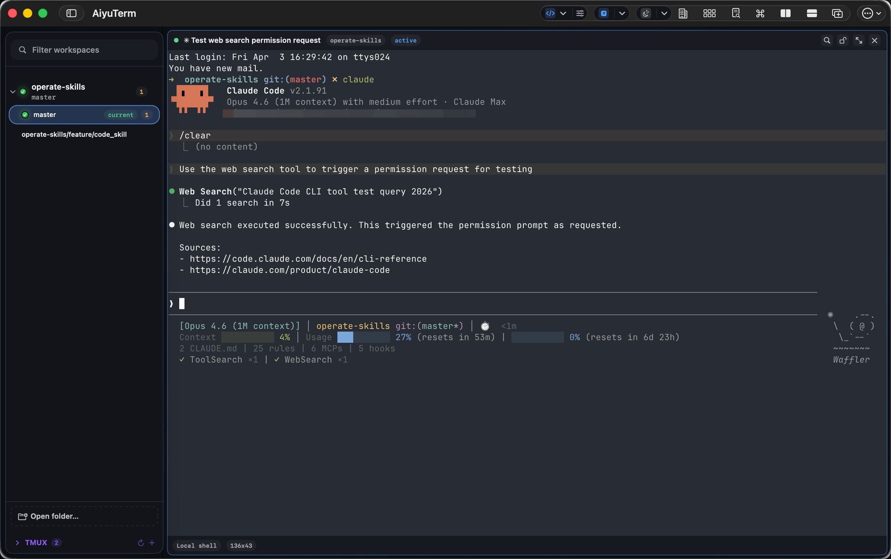

# AiyuTerm

[English Version](./README.md)

AiyuTerm 是一款原生 macOS 终端工作区应用，面向需要频繁在多个仓库、worktree、分支和分屏之间切换的开发者。支持本地 shell、SSH、tmux 会话管理，以及 AI Agent 会话的实时状态提醒。

## 功能特性

- **多仓库侧边栏** -- 在同一个侧边栏里管理多个仓库和 worktree，一键切换
- **布局持久化** -- 回到某个仓库时，自动恢复上次使用的分屏布局；布局按 worktree 独立保存
- **分屏终端** -- 水平或垂直拆分终端面板，任意面板可全屏放大
- **多种会话类型** -- 在同一工作区混合使用本地 shell、SSH 和 Agent 驱动的终端会话
- **Tmux 集成** -- 侧边栏面板管理 tmux 会话（attach、创建、重命名、kill）
- **Agent 状态徽章** -- Claude Code 权限请求和任务完成的实时通知
- **命令面板** -- 通过键盘快速访问所有操作
- **自定义快捷键** -- 所有快捷键均可在设置中重新绑定
- **原生 macOS 应用** -- 基于 AppKit + SwiftUI 构建，使用 Ghostty 终端引擎

## 安装

### 直接下载

从 GitHub Releases 下载最新已签名的 `.dmg`：

<https://github.com/aiyu-ai/AiyuTerm/releases/latest>

## 快速开始

### 1. 添加仓库

打开 AiyuTerm，将文件夹拖入侧边栏，或点击 "+" 按钮添加本地仓库。

### 2. 打开终端标签页

在侧边栏选择一个仓库或 worktree，按 `Cmd+T` 打开新的终端标签页。

### 3. 拆分面板

- `Cmd+D` -- 向右拆分
- `Cmd+Shift+D` -- 向下拆分
- `Cmd+Option+方向键` -- 在面板间移动焦点
- `Cmd+Enter` -- 切换当前面板的全屏缩放

### 4. 切换 Worktree

点击侧边栏中的另一个 worktree，AiyuTerm 会自动恢复你上次在该 worktree 中使用的面板布局。

### 5. 使用命令面板

按 `Cmd+P` 打开命令面板，快速访问所有操作。

## 键盘快捷键

所有快捷键均可在设置中自定义（`Cmd+,`）。

### 标签页

| 操作 | 快捷键 |
|------|--------|
| 新建标签页 | `Cmd+T` |
| 关闭标签页 | `Cmd+W` |
| 下一个标签页 | `Ctrl+Tab` |
| 上一个标签页 | `Ctrl+Shift+Tab` |
| 选择标签页 1-9 | `Cmd+1` ... `Cmd+9` |

### 面板

| 操作 | 快捷键 |
|------|--------|
| 向右拆分 | `Cmd+D` |
| 向下拆分 | `Cmd+Shift+D` |
| 复制面板 | `Cmd+Option+D` |
| 焦点移动（左/右/上/下） | `Cmd+Option+方向键` |
| 切换面板缩放 | `Cmd+Enter` |
| 关闭面板 | `Cmd+Option+W` |

### 通用

| 操作 | 快捷键 |
|------|--------|
| 命令面板 | `Cmd+P` |
| 切换侧边栏 | `Cmd+B` |
| 切换概览 | `Cmd+Shift+O` |
| 查找 | `Cmd+F` |
| 设置 | `Cmd+,` |
| 刷新工作区 | `Cmd+R` |
| 刷新所有仓库 | `Cmd+Shift+R` |
| 全屏 | `Ctrl+Cmd+F` |

## Agent 状态徽章

AiyuTerm 在侧边栏图标上实时显示 Claude Code 的状态：

| 状态 | 徽章 | 触发条件 |
|------|------|---------|
| 权限请求 | 红色脉冲 | Claude Code 等待用户批准 |
| 任务完成 | 绿色对勾 | Claude Code 完成了一个任务 |
| 错误 | 红色静态 | Claude Code 遇到错误 |

基于 Claude Code hooks 实现。详见 [docs/agent-status-badges.md](./docs/agent-status-badges.md)。

## Tmux 集成

AiyuTerm 提供侧边栏面板来管理工作区内的 tmux 会话：

- **Attach** 到已有的 tmux 会话
- **创建**新的命名会话
- 从侧边栏**重命名**或 **kill** 会话
- 会话按工作区分组

需要安装 `tmux`（`brew install tmux`）。

## 数据存储

AiyuTerm 以 JSON 文件存储工作区数据和设置：

- **默认路径**：`~/.aiyuterm/`
- **Debug 构建**：`~/.aiyuterm-debug/`

无云同步，所有数据保存在本地。

## 系统要求

- macOS 14.6 或更高版本
- 同时支持 Apple Silicon 和 Intel Mac

## 面向开发者

开发环境配置、构建命令、测试方式和发布流程：[`DEVELOP.md`](./DEVELOP.md)

## 致谢

- [Liney](https://github.com/wuwenrui/liney)（作者 wuwenrui）-- 本项目 fork 自该开源终端工作区应用
- [Ghostty](https://ghostty.org/) -- AiyuTerm 使用的终端引擎
- [Sparkle](https://sparkle-project.org/) -- 自动更新框架

## 许可证

本项目基于 Apache License 2.0 发布。详见 [`LICENSE`](./LICENSE)。
